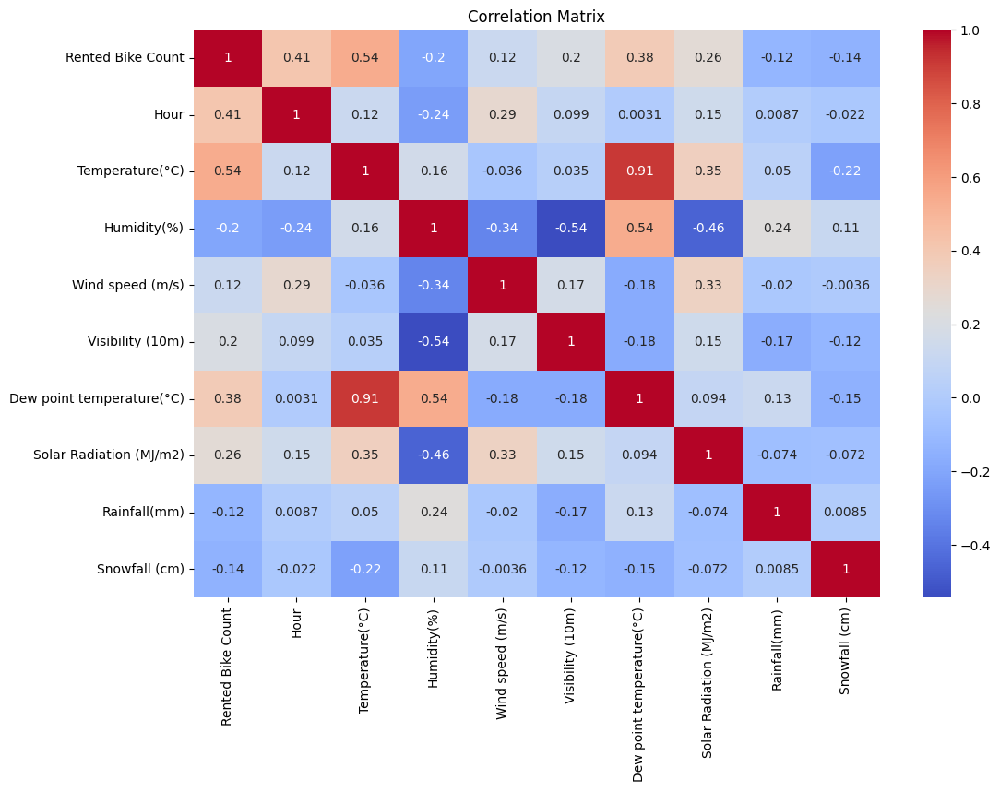
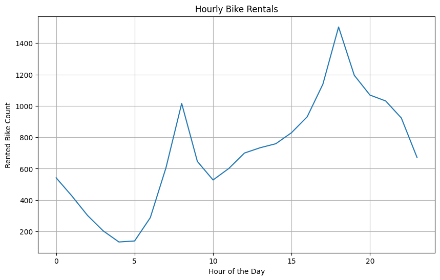
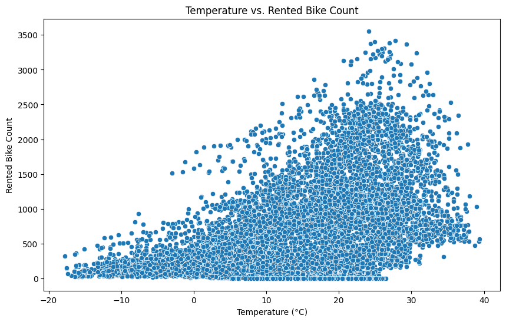
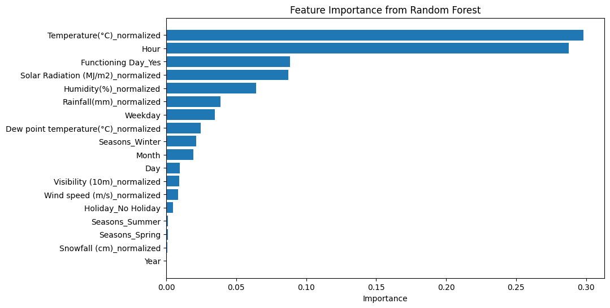
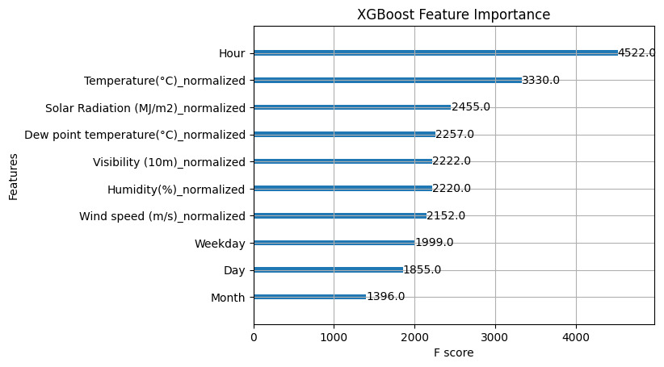

# Seoul Biking Data Analysis
*Analysis of the Seoul Biking Data: Exploratory Data Analysis, Feature Engineering, and Model Training*

In this document we take a look at the Seoul Bike Data (https://archive.ics.uci.edu/dataset/560/seoul+bike+sharing+demand). See the [data license file](./data_license.md) for more information about the data.

We start with some data cleaning and exploratory data analysis in [the first notebook](./seoul_EDA_feature_eng.ipynb). In the [second part of this project](./seoul_model_training.ipynb) we train various models, including: 
- Random forests
- XGBoost, and
- Neural networks

Along the way we use packages such as pandas, seaborn, scikit-learn, and PyTorch.

All details can be found in the two Jupyter notebooks. Here we provide some screenshots summarizing our results.

___

  

  

  

  

  

